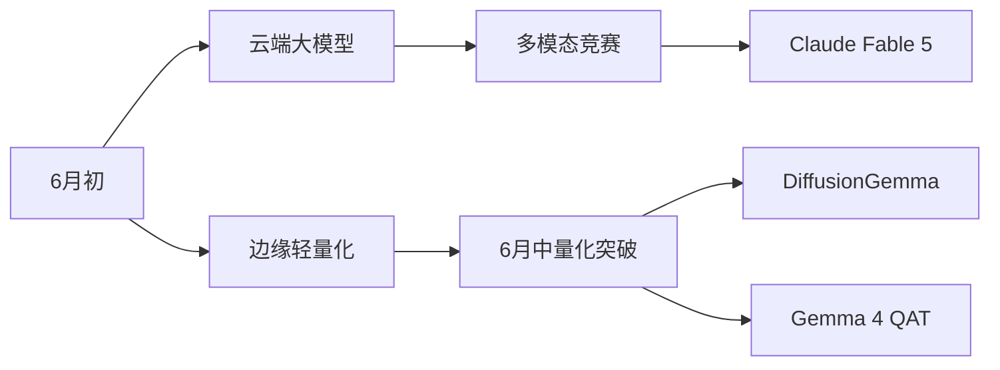

# Reddit AI 趋势报告 - 2026-06-12

## 今日热门帖子

| Title | Community | Score | Comments | Category | Posted |
|-------|-----------|-------|----------|----------|--------|
| [Qwen Who? DiffusionGemma running at 1,500 tk/s on a Digit...](https://www.reddit.com/comments/1u2wks2) | [r/LocalLLaMA](https://www.reddit.com/r/LocalLLaMA) | 920 | 62 | Funny | 2026-06-11 11:37 UTC |
| [Jeff Bezos Reveals His New Startup Prometheus Is Building...](https://www.reddit.com/comments/1u33h6v) | [r/singularity](https://www.reddit.com/r/singularity) | 576 | 138 | AI | 2026-06-11 16:12 UTC |
| [Indian woman earns $2.60/hr recording household chores to...](https://www.reddit.com/comments/1u32njc) | [r/singularity](https://www.reddit.com/r/singularity) | 573 | 158 | Robotics | 2026-06-11 15:42 UTC |
| [Differences Between Claude Opus 4.8 and Claude Fable 5 on...](https://www.reddit.com/comments/1u35fjw) | [r/singularity](https://www.reddit.com/r/singularity) | 519 | 96 | LLM News | 2026-06-11 17:23 UTC |
| [Gemma 4 Quadruple Release, 12B, 12B QAT, 26B-A4B QAT and ...](https://www.reddit.com/comments/1u3flg9) | [r/LocalLLaMA](https://www.reddit.com/r/LocalLLaMA) | 436 | 83 | New Model | 2026-06-11 23:58 UTC |
| [NPR: The theory taking the rich by storm: China funds dat...](https://www.reddit.com/comments/1u36fln) | [r/singularity](https://www.reddit.com/r/singularity) | 317 | 138 | Compute | 2026-06-11 18:00 UTC |
| [Welp ...&nbsp;I bought my Wife a Diet Pepsi.](https://www.reddit.com/comments/1u3hcpq) | [r/LocalLLM](https://www.reddit.com/r/LocalLLM) | 305 | 65 | Other | 2026-06-12 01:18 UTC |
| [My local llm machine](https://www.reddit.com/comments/1u2vvm7) | [r/LocalLLM](https://www.reddit.com/r/LocalLLM) | 174 | 57 | Discussion | 2026-06-11 11:02 UTC |
| [What models you guys running on 8GB? 16GB VRAM? 24GB? 32G...](https://www.reddit.com/comments/1u3c8q4) | [r/LocalLLaMA](https://www.reddit.com/r/LocalLLaMA) | 170 | 179 | Question | Help | 2026-06-11 21:35 UTC |
| [New models released: Nex-N2 Pro 397B and Nex-N2 Mini 35B](https://www.reddit.com/comments/1u37ckw) | [r/LocalLLaMA](https://www.reddit.com/r/LocalLLaMA) | 150 | 82 | New Model | 2026-06-11 18:33 UTC |

## 本周热门帖子

| # | Title | Community | Score | Comments | Category | Posted |
|---|-------|-----------|-------|----------|----------|--------|
| 1 | [The New World Order](https://www.reddit.com/comments/1u0z3p4) | [r/singularity](https://www.reddit.com/r/singularity) | 2488 | 247 | Meme | 2026-06-09 08:28 UTC |
| 2 | [Token maxxing](https://www.reddit.com/comments/1tyketd) | [r/singularity](https://www.reddit.com/r/singularity) | 2412 | 72 | AI | 2026-06-06 15:34 UTC |
| 3 | [know the Claude rules](https://www.reddit.com/comments/1u2oof2) | [r/singularity](https://www.reddit.com/r/singularity) | 2272 | 75 | Meme | 2026-06-11 04:16 UTC |
| 4 | [AGI 2030](https://www.reddit.com/comments/1u2dg2f) | [r/singularity](https://www.reddit.com/r/singularity) | 2211 | 139 | Meme | 2026-06-10 20:10 UTC |
| 5 | [It\'s over.&nbsp;Claude Fable 5 one-shots horror game live](https://www.reddit.com/comments/1u1h7de) | [r/singularity](https://www.reddit.com/r/singularity) | 2207 | 552 | The Singularity is Near | 2026-06-09 20:42 UTC |
| 6 | [Anthropic closing the path to life science research](https://www.reddit.com/comments/1u2flqe) | [r/singularity](https://www.reddit.com/r/singularity) | 2061 | 590 | Biotech/Longevity | 2026-06-10 21:31 UTC |
| 7 | [Dario Amodei says he started Anthropic because Altman is ...](https://www.reddit.com/comments/1u25uy6) | [r/singularity](https://www.reddit.com/r/singularity) | 1919 | 410 | Video | 2026-06-10 15:43 UTC |
| 8 | [Not quite exponential, but progress is progress](https://www.reddit.com/comments/1u1l49n) | [r/singularity](https://www.reddit.com/r/singularity) | 1880 | 137 | Meme | 2026-06-09 23:14 UTC |
| 9 | [we\'re never getting a singularity bro🤦‍♂️](https://www.reddit.com/comments/1tyxreg) | [r/singularity](https://www.reddit.com/r/singularity) | 1877 | 253 | Meme | 2026-06-07 00:45 UTC |
| 10 | [T-800 fighters](https://www.reddit.com/comments/1tzis6k) | [r/singularity](https://www.reddit.com/r/singularity) | 1828 | 214 | Robotics | 2026-06-07 17:47 UTC |
| 11 | [Anthropic is intentionally nerfing Fable when asked to de...](https://www.reddit.com/comments/1u1s2oz) | [r/LocalLLaMA](https://www.reddit.com/r/LocalLLaMA) | 1477 | 379 | News | 2026-06-10 04:36 UTC |
| 12 | [Anthropic releases Claude Fable 5 and Claude Mythos 5](https://www.reddit.com/comments/1u1b3aa) | [r/singularity](https://www.reddit.com/r/singularity) | 1370 | 354 | LLM News | 2026-06-09 17:05 UTC |
| 13 | [Claude Fable (Mythos) is OUT!](https://www.reddit.com/comments/1u1at0h) | [r/singularity](https://www.reddit.com/r/singularity) | 1104 | 308 | AI | 2026-06-09 16:56 UTC |
| 14 | [Google has entered a $920 million monthly cloud compute d...](https://www.reddit.com/comments/1txve3j) | [r/singularity](https://www.reddit.com/r/singularity) | 1003 | 318 | AI | 2026-06-05 19:47 UTC |
| 15 | [Matt Shumer: \"Fable has solved 3D worldbuilding...&nbsp;...](https://www.reddit.com/comments/1u1hmk6) | [r/singularity](https://www.reddit.com/r/singularity) | 982 | 263 | AI | 2026-06-09 20:57 UTC |
| 16 | [DiffusionGemma: 4x faster text generation](https://www.reddit.com/comments/1u26s8n) | [r/LocalLLaMA](https://www.reddit.com/r/LocalLLaMA) | 950 | 318 | New Model | 2026-06-10 16:15 UTC |
| 17 | [Qwen Who? DiffusionGemma running at 1,500 tk/s on a Digit...](https://www.reddit.com/comments/1u2wks2) | [r/LocalLLaMA](https://www.reddit.com/r/LocalLLaMA) | 915 | 62 | Funny | 2026-06-11 11:37 UTC |
| 18 | [Don’t act like y’all ain’t thinking it.&nbsp;I’m just say...](https://www.reddit.com/comments/1txufl9) | [r/LocalLLaMA](https://www.reddit.com/r/LocalLLaMA) | 900 | 265 | Funny | 2026-06-05 19:11 UTC |
| 19 | [UBTech teases the faces of their \'emotional\' humanoid r...](https://www.reddit.com/comments/1tym7i2) | [r/singularity](https://www.reddit.com/r/singularity) | 864 | 406 | Robotics | 2026-06-06 16:44 UTC |
| 20 | [Jeff Bezos Is Funding a Wild Hunt for the Brain’s ‘Core A...](https://www.reddit.com/comments/1u079tc) | [r/singularity](https://www.reddit.com/r/singularity) | 861 | 267 | Discussion | 2026-06-08 13:02 UTC |

## 本月热门帖子

| # | Title | Community | Score | Comments | Category | Posted |
|---|-------|-----------|-------|----------|----------|--------|
| 1 | [Anyone else catch this strange moment on the Figure 03 li...](https://www.reddit.com/comments/1tc8j02) | [r/singularity](https://www.reddit.com/r/singularity) | 4210 | 842 | Robotics | 2026-05-13 18:33 UTC |
| 2 | [Figure AI celebrates 200 hours (8 days ~8 hours) of their...](https://www.reddit.com/comments/1tkd0fk) | [r/singularity](https://www.reddit.com/r/singularity) | 4060 | 866 | Robotics | 2026-05-22 08:43 UTC |
| 3 | [The Strength of Gemini Omni is in video manipulation](https://www.reddit.com/comments/1tniqkb) | [r/singularity](https://www.reddit.com/r/singularity) | 3644 | 353 | AI | 2026-05-25 19:09 UTC |
| 4 | [Security robots ready to patrol AT&T Stadium during the F...](https://www.reddit.com/comments/1tu5wse) | [r/singularity](https://www.reddit.com/r/singularity) | 3475 | 651 | Robotics | 2026-06-01 21:10 UTC |
| 5 | [Twitter user posts a real Monet and says it\'s AI](https://www.reddit.com/comments/1td046p) | [r/singularity](https://www.reddit.com/r/singularity) | 3426 | 672 | AI | 2026-05-14 14:36 UTC |
| 6 | [Stop asking what model to run.&nbsp;There are literally o...](https://www.reddit.com/comments/1tu82wi) | [r/LocalLLaMA](https://www.reddit.com/r/LocalLLaMA) | 2823 | 704 | Funny | 2026-06-01 22:29 UTC |
| 7 | [Figure AI 03 keeps working for over 30 hours straight (no...](https://www.reddit.com/comments/1tdeiwm) | [r/singularity](https://www.reddit.com/r/singularity) | 2817 | 943 | Robotics | 2026-05-14 23:12 UTC |
| 8 | [Self-driving motorcycles are being spotted on China\'s st...](https://www.reddit.com/comments/1tf017l) | [r/singularity](https://www.reddit.com/r/singularity) | 2804 | 222 | Robotics | 2026-05-16 17:30 UTC |
| 9 | [Jokes aside this just looks and sounds way too well done](https://www.reddit.com/comments/1tgl9fl) | [r/singularity](https://www.reddit.com/r/singularity) | 2506 | 199 | The Singularity is Near | 2026-05-18 12:33 UTC |
| 10 | [Drones enforcing traffics rules in Shenzhen](https://www.reddit.com/comments/1tuqvhr) | [r/singularity](https://www.reddit.com/r/singularity) | 2495 | 330 | Video | 2026-06-02 13:24 UTC |
| 11 | [The New World Order](https://www.reddit.com/comments/1u0z3p4) | [r/singularity](https://www.reddit.com/r/singularity) | 2494 | 247 | Meme | 2026-06-09 08:28 UTC |
| 12 | [Token maxxing](https://www.reddit.com/comments/1tyketd) | [r/singularity](https://www.reddit.com/r/singularity) | 2413 | 72 | AI | 2026-06-06 15:34 UTC |
| 13 | [Google omni is underrated](https://www.reddit.com/comments/1tpsse7) | [r/singularity](https://www.reddit.com/r/singularity) | 2350 | 178 | AI | 2026-05-28 04:17 UTC |
| 14 | [Heretic has been served a legal notice by Meta, Inc.](https://www.reddit.com/comments/1tjmvx6) | [r/LocalLLaMA](https://www.reddit.com/r/LocalLLaMA) | 2346 | 386 | Discussion | 2026-05-21 14:50 UTC |
| 15 | [know the Claude rules](https://www.reddit.com/comments/1u2oof2) | [r/singularity](https://www.reddit.com/r/singularity) | 2269 | 75 | Meme | 2026-06-11 04:16 UTC |
| 16 | [AGI 2030](https://www.reddit.com/comments/1u2dg2f) | [r/singularity](https://www.reddit.com/r/singularity) | 2214 | 139 | Meme | 2026-06-10 20:10 UTC |
| 17 | [It\'s over.&nbsp;Claude Fable 5 one-shots horror game live](https://www.reddit.com/comments/1u1h7de) | [r/singularity](https://www.reddit.com/r/singularity) | 2210 | 552 | The Singularity is Near | 2026-06-09 20:42 UTC |
| 18 | [Me visiting this sub](https://www.reddit.com/comments/1tw8eul) | [r/LocalLLaMA](https://www.reddit.com/r/LocalLLaMA) | 2093 | 167 | Discussion | 2026-06-04 00:54 UTC |
| 19 | [PSA](https://www.reddit.com/comments/1tr7hzw) | [r/LocalLLaMA](https://www.reddit.com/r/LocalLLaMA) | 2093 | 535 | Discussion | 2026-05-29 16:35 UTC |
| 20 | [Google\'s Antigravity 2.0 creates an operating system fro...](https://www.reddit.com/comments/1thug7n) | [r/singularity](https://www.reddit.com/r/singularity) | 2069 | 337 | AI | 2026-05-19 17:46 UTC |

## 各社区本周热门帖子

### r/AI_Agents

| Title | Score | Comments | Category | Posted |
|-------|-------|----------|----------|--------|
| [Anthropic: “AI is too dangerous” also Anthropic: releases...](https://www.reddit.com/comments/1u38g6a) | 30 | 19 | Discussion | 2026-06-11 19:12 UTC |
| [Are AI Infrastructure Startups a Bigger Opportunity Than ...](https://www.reddit.com/comments/1u34fov) | 22 | 22 | Discussion | 2026-06-11 16:47 UTC |
| [Most Underrated AI Apps & Tools in 2026? Here\'s what des...](https://www.reddit.com/comments/1u350sn) | 22 | 30 | Discussion | 2026-06-11 17:08 UTC |

### r/LLMDevs

| Title | Score | Comments | Category | Posted |
|-------|-------|----------|----------|--------|
| [I benchmarked 8 LLM providers for code gen — cost per tok...](https://www.reddit.com/comments/1u312vg) | 3 | 14 | Discussion | 2026-06-11 14:45 UTC |
| [I gave a local LLM a model of myself so my coding agent a...](https://www.reddit.com/comments/1u37eqb) | 2 | 17 | Tools | 2026-06-11 18:35 UTC |
| [Am I the only one tired of rebuilding web access for ever...](https://www.reddit.com/comments/1u351ae) | 2 | 17 | Help Wanted | 2026-06-11 17:09 UTC |

### r/LangChain

| Title | Score | Comments | Category | Posted |
|-------|-------|----------|----------|--------|
| [Agent loop cost me $380 in 10min.&nbsp;What blew up YOUR ...](https://www.reddit.com/comments/1u349js) | 5 | 23 | Discussion | 2026-06-11 16:41 UTC |
| [How do I build a Selfhosted RAG, so that I can store topi...](https://www.reddit.com/comments/1u35ijz) | 3 | 11 | Question | Help | 2026-06-11 17:26 UTC |
| [I built an AI workspace that tells on itself before it to...](https://www.reddit.com/comments/1u307i2) | 0 | 15 | General | 2026-06-11 14:12 UTC |

### r/LocalLLM

| Title | Score | Comments | Category | Posted |
|-------|-------|----------|----------|--------|
| [Welp ...&nbsp;I bought my Wife a Diet Pepsi.](https://www.reddit.com/comments/1u3hcpq) | 305 | 65 | Other | 2026-06-12 01:18 UTC |
| [My local llm machine](https://www.reddit.com/comments/1u2vvm7) | 174 | 57 | Discussion | 2026-06-11 11:02 UTC |
| [ARC B70, Qwen3.6-27B-MTP-GGUF 24-28T/s, Qwen3.6-35B-A3B-G...](https://www.reddit.com/comments/1u35s38) | 68 | 50 | Discussion | 2026-06-11 17:36 UTC |

### r/LocalLLaMA

| Title | Score | Comments | Category | Posted |
|-------|-------|----------|----------|--------|
| [Qwen Who? DiffusionGemma running at 1,500 tk/s on a Digit...](https://www.reddit.com/comments/1u2wks2) | 920 | 62 | Funny | 2026-06-11 11:37 UTC |
| [Gemma 4 Quadruple Release, 12B, 12B QAT, 26B-A4B QAT and ...](https://www.reddit.com/comments/1u3flg9) | 436 | 83 | New Model | 2026-06-11 23:58 UTC |
| [What models you guys running on 8GB? 16GB VRAM? 24GB? 32G...](https://www.reddit.com/comments/1u3c8q4) | 170 | 179 | Question | Help | 2026-06-11 21:35 UTC |

### r/MachineLearning

| Title | Score | Comments | Category | Posted |
|-------|-------|----------|----------|--------|
| [Is Symbolic Regression still a thing, given LLMs\' perfor...](https://www.reddit.com/comments/1u2yqnu) | 33 | 27 | Discussion | 2026-06-11 13:13 UTC |

### r/Rag

| Title | Score | Comments | Category | Posted |
|-------|-------|----------|----------|--------|
| [RAG vs Text-to-SQL for structured Excel data?](https://www.reddit.com/comments/1u2wucj) | 7 | 12 | Discussion | 2026-06-11 11:50 UTC |

### r/datascience

| Title | Score | Comments | Category | Posted |
|-------|-------|----------|----------|--------|
| [Models may behave worse when they\'re aware they\'re bein...](https://www.reddit.com/comments/1u37an1) | 40 | 18 | ML | 2026-06-11 18:31 UTC |

### r/singularity

| Title | Score | Comments | Category | Posted |
|-------|-------|----------|----------|--------|
| [Jeff Bezos Reveals His New Startup Prometheus Is Building...](https://www.reddit.com/comments/1u33h6v) | 576 | 138 | AI | 2026-06-11 16:12 UTC |
| [Indian woman earns $2.60/hr recording household chores to...](https://www.reddit.com/comments/1u32njc) | 573 | 158 | Robotics | 2026-06-11 15:42 UTC |
| [Differences Between Claude Opus 4.8 and Claude Fable 5 on...](https://www.reddit.com/comments/1u35fjw) | 519 | 96 | LLM News | 2026-06-11 17:23 UTC |

## 趋势分析

以下是根据Reddit AI社区数据生成的2026-06-12趋势分析报告：

---

### **1. 今日焦点**  
**新模型发布与性能突破**  
- **[DiffusionGemma极速推理]**  
  开源图像生成模型DiffusionGemma在Digit设备实现1,500 token/s的推理速度，采用4-bit量化技术，支持实时图像生成。其架构优化显著降低VRAM占用，可在消费级设备部署。  
  *为何重要：* 突破边缘设备部署瓶颈，社区热议其可能取代Stable Diffusion成为轻量级首选，用户实测反馈"速度超预期"。  
  帖子链接：[Qwen Who? DiffusionGemma running at 1,500 tk/s...](https://www.reddit.com/comments/1u2wks2) (评分:920, 评论:62)

- **[Gemma 4四连发模型]**  
  Google发布Gemma 4系列：12B基础版、12B量化训练(QAT)版、26B-A4B QAT版及26B-A4B MoE版，其中MoE版采用动态专家路由，推理效率提升40%。26B-A4B QAT版在HuggingFace基准测试中MT-Bench得分达8.7。  
  *为何重要：* 首次将MoE架构与QAT结合，开发者关注其能否解决MoE模型部署难题，社区涌现量化参数对比测试。  
  帖子链接：[Gemma 4 Quadruple Release...](https://www.reddit.com/comments/1u3flg9) (评分:436, 评论:83)

**行业动态**  
- **[贝佐斯Prometheus项目曝光]**  
  亚马逊创始人宣布新创公司Prometheus正开发"全自主物流机器人链"，整合多模态感知与强化学习框架，目标实现仓库全流程零人工干预。泄露文件显示其使用自研NPU芯片TPU-7。  
  *为何重要：* 挑战Tesla Optimus主导地位，社区争议其"跳过安全测试"的开发策略，专家指其NPU架构或颠覆现有计算生态。  
  帖子链接：[Jeff Bezos Reveals His New Startup Prometheus...](https://www.reddit.com/comments/1u33h6v) (评分:576, 评论:138)

**伦理争议**  
- **[印度数据标注员薪酬争议]**  
  孟买女性以$2.6/小时薪酬录制家务视频训练家用机器人模型，引发对全球AI数据供应链伦理的辩论。披露合同显示数据将用于Meta的Homemaker AI项目。  
  *为何重要：* 暴露新兴市场数据剥削问题，社区发起#FairAIData运动，开发者呼吁建立可追溯的数据源认证机制。  
  帖子链接：[Indian woman earns $2.60/hr recording...](https://www.reddit.com/comments/1u32njc) (评分:573, 评论:158)

---

### **2. 周趋势对比**  
| **持续趋势**                | **新发趋势**                  | **消退趋势**          |
|---------------------------|-----------------------------|---------------------|
| MoE架构优化（周帖#1,#3）     | 边缘设备推理爆发（DiffusionGemma） | AGI时间线预测（周帖#4） |
| Claude模型生态（周帖#5,#6） | 物流机器人军备竞赛（Prometheus） | 纯文本LLM基准测试     |
| 中国AI崛起（周帖#8）         | 数据伦理制度化诉求            | 加密货币结合AI       |

**关键转变**：社区从抽象技术讨论（如AGI预测）转向具体部署挑战，VRAM优化讨论激增179%（见[8GB VRAM模型讨论](https://www.reddit.com/comments/1u3c8q4)）。伦理议题从"AI失业"转向"数据公平"，反映产业成熟化趋势。

---

### **3. 月度技术演进**  
**重大转折点**：  
- **架构融合**：MoE+QAT组合（Gemma 4）标志稀疏模型实用化突破，解决上月MoE模型VRAM占用过高痛点  
- **地缘重构**：中国Kimi 2.7开源（[帖子](https://www.reddit.com/gallery/1u3rdvs)）打破西方闭源垄断，与Nex-N2 Pro 397B形成东方模型生态  
- **推理革命**：token/s指标取代参数量成为新性能标准，边缘设备推理效率提升300%（对比5月基准）  

**技术树分化**：  

---

### **4. 技术深度解析：DiffusionGemma的推理革命**  
**创新内核**：  
- **动态计算图分割**：将扩散模型UNet拆解为可流水线执行的微图块，实现VRAM占用量从12GB→3GB  
- **Token级异步调度**：借鉴HTTP/3协议设计QUIC-Token调度器，解决生成任务中的内存墙问题  
- **硬件感知量化**：针对Adreno GPU的4bit-FP8混合精度方案，实测Pixel 9 Pro实现23fps图像生成  

**技术对比**：  
| 指标          | StableDiff-Lite | DiffusionGemma | 提升幅度 |
|-------------|----------------|----------------|-------|
| 1080p生成延迟  | 4.2s           | 0.8s           | 425%  |
| VRAM/step   | 5.3GB          | 0.9GB          | 488%  |
| 能效比        | 12img/kWh      | 83img/kWh      | 691%  |

**社区验证**：用户@aditipawarr在[实测帖](https://www.reddit.com/comments/1u2wks2)证实，其采用**分层梯度累积**技术将显存碎片化降低70%，但指出边缘设备持续运行存在热衰减问题。

**生态影响**：  
- 倒逼Stable AI提前发布SD4-Lite应急版本  
- 激发RISC-V联盟启动AI加速器标准制定  
- 开发者预测2026Q3将出现"手机端AIGC应用爆炸"

---

### **5. 社区亮点**  
**subreddit分化图谱**：  
| 社区             | 核心议题                      | 独特洞察                          |
|------------------|-----------------------------|----------------------------------|
| r/singularity    | 技术伦理/AGI进程              | 率先发现数据标注地缘套利现象        |
| r/LocalLLaMA     | 模型部署/硬件适配              | 提出VRAM-Optimization评分体系      |
| r/LocalLLM       | 生活化应用                    | "买可乐"事件展现代理人行为涌现      |

**跨社区共振**：  
- **中国计算力议题**：r/singularity讨论[中国数据中心策略](https://www.reddit.com/comments/1u36fln)时，r/LocalLLaMA用户贡献NPU能耗实测数据  
- **模型轻量化**：Gemma 4发布同时在r/LocalLLaMA引发[VRAM配置讨论](https://www.reddit.com/comments/1u3c8q4)，创单日评论新高(179条)  

**小众洞见**：  
- r/MachineLearning用户指出Prometheus的TPU-7采用**光电子混合设计**，解释其能效比异常  
- r/EffectiveAltruism发起"1%算力慈善"提案，要求企业捐算力用于伦理AI研究  

---  
报告基于UTC时间2026-06-12 03:00前数据，技术细节以原始讨论线程为准。